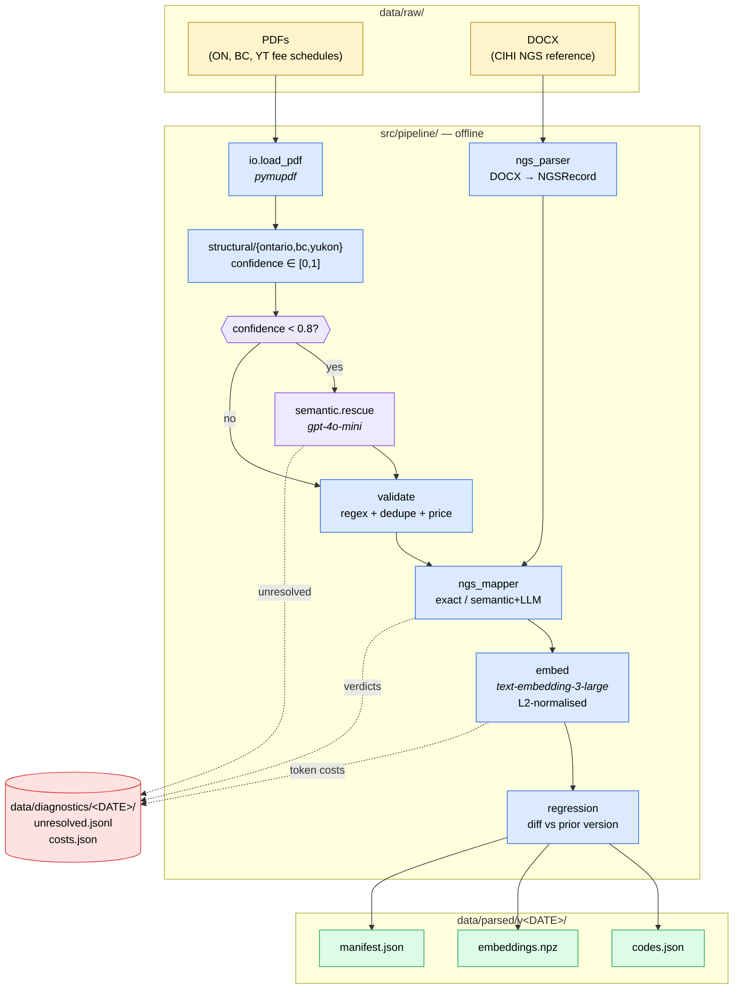
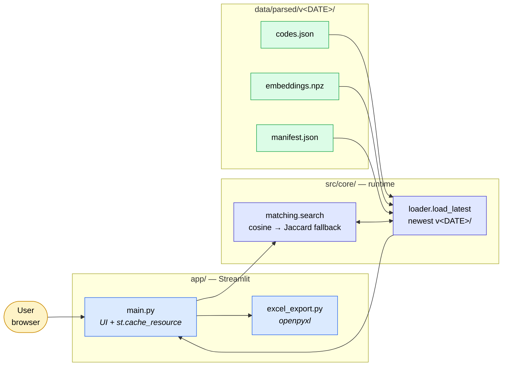
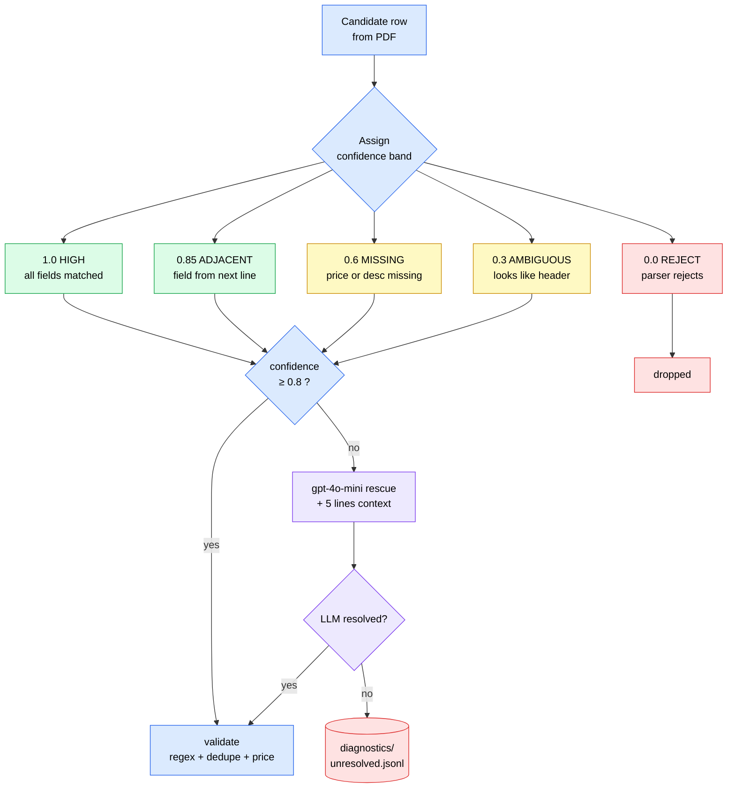

# FSC Cross-Province Lookup

> Map physician **Fee Service Codes (FSC)** across Ontario, British Columbia, and Yukon, with each code linked to its **CIHI National Grouping System (NGS)** category.

Enter one FSC code from one province (e.g. `K040` from Ontario) and get the closest equivalents in every other province in seconds — replacing what used to be an hours-long manual lookup.

---

## What it does

<table>
<tr>
<td width="50%" valign="top">

**Input:** `K040` in `ON`
**Output:** top-N matches in `BC` and `YT`, ranked by semantic similarity, with the anchor's NGS category and same-NGS flag surfaced for every match.

- Three provinces out of the box: **ON, BC, YT**
- ~7,000 fee codes across all three
- Semantic search (OpenAI embeddings) with Jaccard fallback
- One-click Excel export
- Fully offline runtime — Streamlit reads pre-built artifacts

</td>
<td width="50%" valign="top">

**Sources:**

| Province | Schedule |
|----------|----------|
| Ontario | MOH Schedule of Benefits |
| British Columbia | MSC Payment Schedule |
| Yukon | Physician Fee Guide |

**Linked taxonomy:** CIHI NGS categories from the official NPDB reference DOCX.

</td>
</tr>
</table>

---

## Pipeline at a glance

Raw provincial PDFs → structured extraction → LLM rescue for ambiguous rows → validation → NGS mapping → OpenAI embeddings → versioned artifacts.



The pipeline is **idempotent** (skip-if-output-exists, `--force` to redo) and **resumable** (every OpenAI call is disk-cached by request body, so re-runs cost nothing). A regression gate compares each new run to the previous version and fails loud on a ≥5% code-count drop or a missing golden-set code.

---

## Quick start

### 1. Install

```bash
pip install -r requirements.txt
```

Windows + Git Bash supported. No GPU required.

### 2. Configure OpenAI

```bash
cp .env.example .env
# edit .env and set OPENAI_API_KEY=sk-...
```

Optional overrides (defaults shown):
```bash
OPENAI_EMBED_MODEL=text-embedding-3-large
OPENAI_EMBED_DIM=1024
OPENAI_EXTRACT_MODEL=gpt-4o-mini
```

### 3. Build the database

Drop raw PDFs in `data/raw/pdf/` and reference DOCXs in `data/raw/docx/`, then:

```bash
python -m src.cli run
```

Writes `data/parsed/v<DATE>/{codes.json, embeddings.npz, manifest.json}`. Typical run: **under 10 minutes, under $1** in OpenAI fees.

Add `--force` to rebuild even if artifacts exist. Add `--accept-regression "reason"` to bypass the gate (justification stored in the manifest).

### 4. Launch the app

```bash
streamlit run app/main.py
```

Open `http://localhost:8501`.

---

## Runtime architecture

The Streamlit app imports from `src/core/` and reads the newest `data/parsed/v<DATE>/` bundle once (cached for the process via `@st.cache_resource`). Nothing at runtime touches PDFs, DOCXs, or OpenAI.



**Two search paths, auto-selected:**
- **Semantic** (preferred) — cosine similarity over L2-normalised OpenAI embeddings. A single matrix-vector dot product per query.
- **Jaccard fallback** — blended `0.4·jaccard + 0.6·overlap` on tokenised descriptions. Used when `embeddings.npz` is missing.

Both paths rank purely by description similarity. **Same-NGS is flagged but does not boost scores** — two provinces can legitimately assign equivalent procedures to different NGS codes, and conflating those two signals corrupts ranking. See the comment block in `src/core/matching.py`.

---

## Extraction: how ambiguous rows get rescued

Every structural extractor assigns an explicit confidence band to each candidate row. Rows below 0.8 are automatically routed to `gpt-4o-mini` with the surrounding 5 lines of PDF context. The LLM either fills in the missing fields or marks the row unresolved (which lands in `data/diagnostics/<DATE>/unresolved.jsonl` for audit).



| Confidence | Meaning | Routed to |
|---|---|---|
| `1.0` HIGH | all fields matched cleanly | validate |
| `0.85` ADJACENT_FIELD | one field from adjacent line | validate |
| `0.6` MISSING_FIELD | price or description missing | **LLM rescue** |
| `0.3` AMBIGUOUS | looks like a table header | **LLM rescue** |
| `0.0` REJECT | parser rejects outright | (dropped) |

This split buys us **auditable structural extraction on 95%+ of rows** (diffable year-over-year, fails loud when a PDF layout changes) plus **LLM recall for the stragglers** — without paying for an LLM on every row.

---

## Project structure

```
fsc-ngs-ai/
├── app/                       # Streamlit UI — imports src/core only
│   ├── main.py
│   └── excel_export.py        # Columns derived from FeeCodeRecord.model_fields
├── src/
│   ├── pipeline/              # Offline pipeline — only writer of data/parsed/
│   │   ├── schema.py            # Canonical pydantic models (single source of truth)
│   │   ├── io.py                # pymupdf loader
│   │   ├── structural/          # Per-province extractors (ontario/bc/yukon)
│   │   ├── semantic.py          # gpt-4o-mini rescue
│   │   ├── validate.py          # Province regex + dedupe + price gate
│   │   ├── ngs_parser.py        # DOCX → NGSRecord
│   │   ├── ngs_mapper.py        # FSC → NGS (exact / semantic / LLM verdict)
│   │   ├── embed.py             # OpenAI embeddings, L2-normalised
│   │   ├── regression.py        # Diff vs prior version, fail loud
│   │   └── run.py               # Orchestrator
│   ├── core/                  # Runtime — only reader of data/parsed/
│   │   ├── loader.py
│   │   └── matching.py          # search() — cosine + Jaccard fallback
│   ├── openai_client.py       # Single chokepoint (httpx + hishel disk cache)
│   └── cli.py                 # Typer CLI
├── data/
│   ├── raw/                   # Source PDFs + DOCXs (gitignored)
│   └── parsed/v<DATE>/        # Versioned artifacts
├── tests/                     # unit / integration / property / regression
├── docs/
│   └── superpowers/           # Design spec + implementation plan
└── requirements.txt
```

---

## Key design decisions

**One canonical schema.** `FeeCodeRecord` in `src/pipeline/schema.py` is a frozen pydantic model with `extra="forbid"`, shared across pipeline output, matching input, and Excel export. Adding a field is a single edit that flows everywhere — no parallel `COLUMNS` list to drift.

**Single OpenAI chokepoint.** `src/openai_client.py` is the only module that imports `openai`. It wraps the SDK with an httpx transport + hishel `FilterPolicy(use_body_key=True)` disk cache, so identical prompts on re-runs never hit the API a second time. Batched embeddings, exponential backoff on transient errors, fast-fail on deterministic ones.

**Versioned data artifacts.** Every pipeline run writes to `data/parsed/v<YYYY-MM-DD>/` rather than overwriting. `codes.json` and `manifest.json` are committed; `embeddings.npz` is gitignored. Rollback is a directory rename.

**Positional coupling between codes.json and embeddings.npz.** `src/pipeline/run.py` sorts records by `(province, fsc_code)` exactly once, before writing both files. Row `i` in `codes.json` corresponds to row `i` in `.npz`. A deliberate inline comment warns against adding filters between the sort and the embed call.

**Same-NGS is informational, not a ranking signal.** Two provinces can legitimately map equivalent procedures to different NGS codes. The UI shows a badge; the ranker ignores it. This is load-bearing; don't "fix" it without reading the matching docstring.

---

## Tests

```bash
pytest                      # everything
pytest -m unit              # fast, no I/O  (~85 tests)
pytest -m integration       # full pipeline against fixtures or real artifacts
pytest -m property          # hypothesis-based schema roundtrips
pytest -m regression        # snapshot diff vs tests/regression/snapshot_codes.json
```

Integration and regression tests skip cleanly when there are no `data/parsed/v*/` artifacts — so a fresh clone runs green immediately.

---

## Cost & runtime

| Phase | Time | OpenAI cost |
|---|---|---|
| Full pipeline run (first time) | ~10 min | ~$0.50-$1.00 |
| Re-run with cached calls | ~5 min | $0 (all cached) |
| App startup | ~2 sec | $0 (offline) |
| Single lookup query | <100 ms | $0 (offline) |

All OpenAI dollars come from structural-rescue (`gpt-4o-mini`) + embeddings + NGS verdicts during the pipeline build. The runtime lookup path never calls OpenAI in Phase 1.

---

## Roadmap

Phase 1 (**done** — this repo) is the rebuilt pipeline with OpenAI embeddings and no GPU/Mistral dependencies.

- **Phase 2** — `gpt-4o` reranker over top-20 retrieval with structured rationale and confidence per match.
- **Phase 3** — streamed rationale generation, natural-language search ("knee arthroscopy with meniscus repair" → codes), "why not X?" drill-downs.
- **Phase 4** — FastAPI service wrapping `src/core/`, SQLite/DuckDB storage, Docker.
- Additional provinces (AB, QC, NS, ...).
- Batch / CSV lookup.

See `docs/superpowers/specs/2026-04-13-fsc-ngs-rebuild-design.md` for the full design and `docs/superpowers/plans/2026-04-13-fsc-ngs-phase1-pipeline.md` for the Phase 1 implementation plan.
